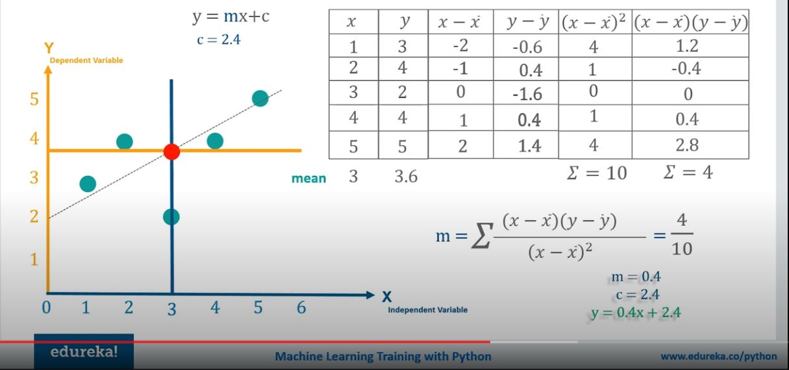

<h2>Linear Regression</h2>

<h3>Intro</h3>
<ul>
  <li>Linear Regression - approximating linear function to scatter data in order to find out the general trend.</li>
  <li>In regressing we want to predict continueous values as opposed to classification where we want to predict a classification of a case.</li>
  <li>In order to get linear function there are following calculations:
     
     
    
  </li>
</ul>
