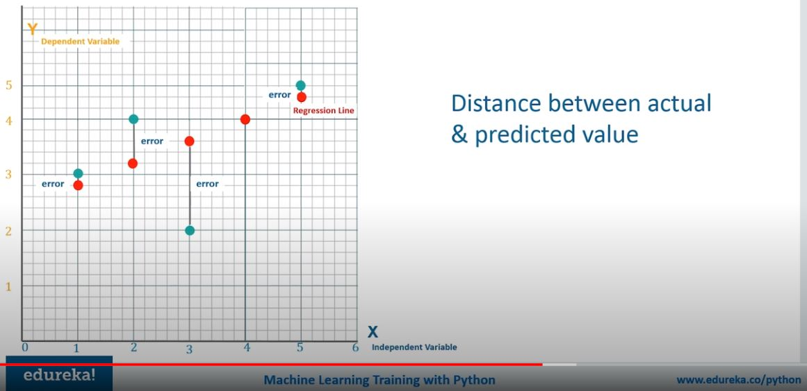

<h2>Linear Regression</h2>

<b>Regression analysis</b> is a predictive method that allos investigating the relationship between y (dependent variable) and x (independent value).

<h3>Application of regression</h3>
<ul>
  <li>Determining the strength of ralationships betwenn variables - of how x values effects y values:
     
    - e.g. relationship between employee's age and income, earnings and marketing spend.
  </li>
  <li>Forecasting impact or effect on y values by changing one or more x values:
     
    - e.g. how much income increases when 10 000 USD invested in the specific business field.
  </li>
  <li>Trend and future values forcasting:
     
    - estimating the sales in the future when trend is stable in time.
  </li> 
</ul>

<h3>Linear Regression</h3>
<ul>
  <li>Approximating linear function to scatter data.</li>
  <li>Linear correlation between continuous x and y variable.</li>
  <li>LR output/prediction is the value of variable.</li>
  <li>Accuracy measured by loss or R square.</li>
  <li>When y values increase along with growth of x values then we have <b>positive linear regression</b>:
     
    - the function equation: y = mx + c
  </li>
  <li>When y values decrease along with growth of x values then we have <b>negative linear regression</b>:
     
    - the function equation: y = -mx + c
  </li>
  <li>Where:
     
    - y is dependent variable 
    - x is independent variable 
    - m is a slope of the line 
    - c is point of intersection with y axis
  </li>
</ul>

<h3>Algorithm</h3>
<ul>
  <li>In regressing we want to predict continueous values as opposed to classification where we want to predict a classification of a case i.e. label or 0/1 category.</li>
  <li>Calculating line of regression:
     
     
    1. Calculating m and c coeffeicients based on the actual x and y values:
     
     
    
     
     
    2. Linear function through the predicted points for given m, c and set of x's values:
     
     
    
     
     
    3. We treat the distance between actal value and predicted one as an error:
     
     
    
     
     
  </li>
  <li> Finding the best fit regression line with <b>gradient search</b>
     
    - the main purpose on this is to reduce the error = > the smallest error, the best fit line 
    - performing n iterations for different m  
    - using different value of m we calculate the equation of <b>y = mx + c</b>  
    - after every iteration, a predicted value y is being calculated using different m value    
     
    - credits go to edureka.co
     
     
    - next step is comparing distances between actual value and predicted one  
    - when in a current iteration the distance between the predicted value and actual one is minimum - for this iteration we take m value for the best fit line  
  </li>
</ul>

<h3>Accuracy</h3>
<ul>
  <li>R squarred method to assess how close the data are to the fitted regression line.</li>
   
  
   
  <li>When <b>R ** 2 = 1</b> then predicted values covers actual values in 100%.</li>
  <li>When <b>R ** 2 = 0.002</b> then actual values are very far from line of regression
     
    - a lof of so called outliers  
    - I cannot take any forecast anything from the data
  </li>
</ul>
